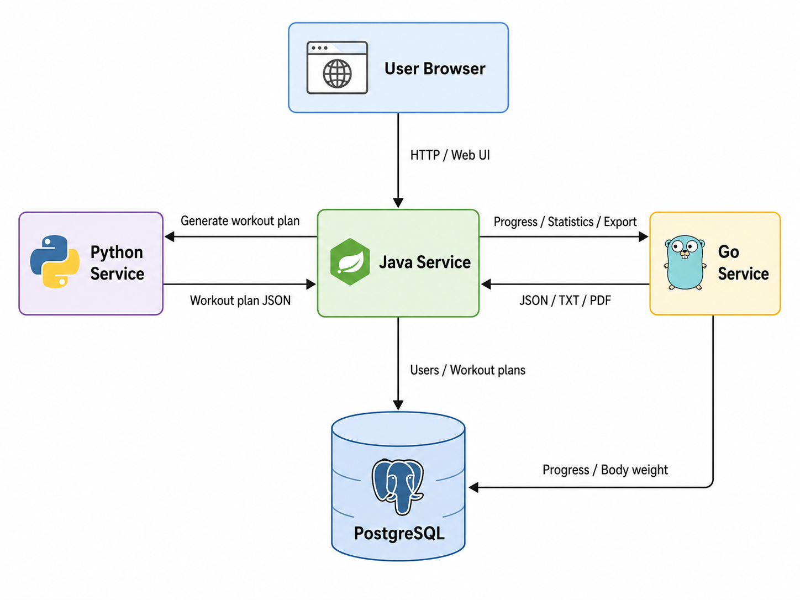

# Архитектура проекта

Fitness App — это мультисервисное приложение, состоящее из Java-service, Go-service, Python-service и PostgreSQL.

## Общая схема взаимодействия

## Роли сервисов

### Java Service

Java-service отвечает за пользовательский интерфейс, авторизацию, регистрацию, обработку форм, хранение сгенерированных тренировочных планов и взаимодействие с другими сервисами.

Java-service является центральным сервисом приложения: пользователь работает именно с ним через браузер, а Java уже обращается к Python-service и Go-service.

### Python Service

Python-service отвечает за генерацию тренировочного плана на основе пользовательских параметров.

Java-service отправляет в Python-service данные анкеты пользователя, а Python-service возвращает готовую структуру тренировочного плана в формате JSON.

### Go Service

Go-service отвечает за сохранение тренировочного прогресса, сохранение веса пользователя, расчёт статистики, подготовку данных для графиков и экспорт тренировочных планов в TXT/PDF.

Java-service отправляет в Go-service данные о прогрессе пользователя и получает обратно статистику или готовый файл экспорта.

### PostgreSQL

PostgreSQL используется как единая база данных проекта.

В базе данных хранятся:

- пользователи;
- упражнения;
- тренировочные планы;
- элементы тренировочных планов;
- логи прогресса;
- история веса пользователя.