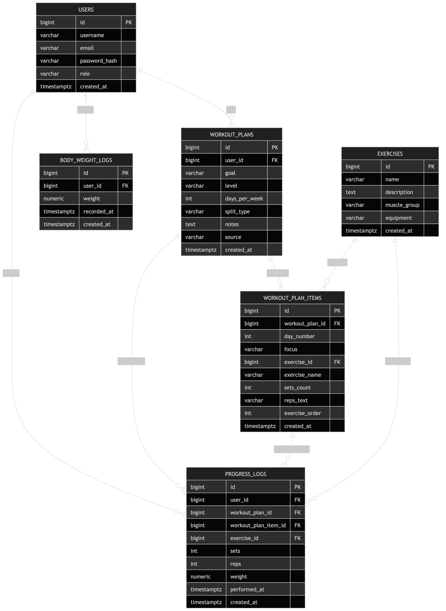

# Структура базы данных

Проект использует единую PostgreSQL базу данных со схемой `fitness_tracker`.

## Основные таблицы

- `users` — пользователи приложения.
- `exercises` — каталог упражнений.
- `workout_plans` — сгенерированные тренировочные планы пользователей.
- `workout_plan_items` — упражнения внутри конкретного тренировочного плана.
- `progress_logs` — логи выполненных тренировок.
- `body_weight_logs` — история веса пользователя.

## Схема базы данных

